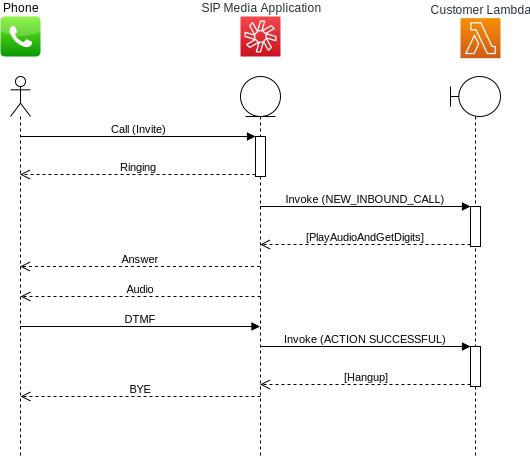

## PSTN dial-in for Amazon Chime SDK with Amazon Chime SIP Media Application

[](https://github.com/aws-samples/chime-sipmediaapplication-samples/stargazers)


Making it easy to add PSTN dialin capabilities to your Amazon Chime SDK Meeting using SIP Media Application

## On this Page
- [Overview](#project-overview)
- [Architecture](#architecture-overview)
- [Setup](#getting-started)
- [Security](#Security)
- [License](#License)

## Overview
Amazon Chime SIP Media Application (SMA) provides PSTN calling support for the Amazon Chime SDK, a feature that enables developers to offer phone numbers and customized interactive voice response (IVR) with their application so that participants can dial-in and dial-out to Chime SDK meetings using a regular telephone. 

## Architecture


## Setup

### 1. Prerequisites
- Install [AWS Command Line Interface](https://aws.amazon.com/cli/)
- Clone the repo
- Get permission to Amazon Chime Administration Console

### 2. Lambda deployment
Zip you lambda function.
```
zip function.zip ./src/index.js
```

Configure AWS Command Line Interface.
```
aws configure
```

Create S3 bucket to upload the lambda code
```
aws s3api create-bucket --bucket source-us-east-1-<accountid> --region us-east-1
```

Package local artifacts
```
aws cloudformation package --template-file ./infrastructre/deployment-template.yaml --s3-bucket source-us-east-1-<accountid> --force-upload --output-template-file packaged.yaml
```

Deploy the lambda
> :warning: **use --parameter-overrides BucketNamePrefixParameter=<string> TableNameParameter=<string> FunctionNameParameter=<string> to overried default values**

```
aws cloudformation deploy --template-file packaged.yaml --stack-name SIPMediaAppSample --region us-east-1 --capabilities CAPABILITY_IAM
```

### 3. Copy audio files to S3 bucket
> :warning: **You can find the bucket name from AWS S3 Console**
```
aws s3 cp ./resources/ s3://<bucketName>/ --recursive --exclude "*" --include "*.wav"
```

### 4. Setup SIP Media Application
- Follow [Amazon Chime Admin guide](https://docs.aws.amazon.com/chime/latest/ag/manage-sip-applications.html) to create SIP Media Application and SIP Rule

## Security

See [CONTRIBUTING](CONTRIBUTING.md#security-issue-notifications) for more information.

## License

This library is licensed under the MIT-0 License. See the LICENSE file.

